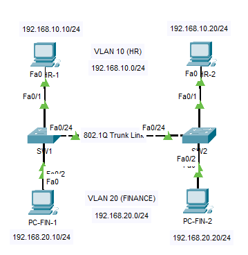

# 🌐 VLAN Segmentation and 802.1Q Trunking Lab

## 📖 Overview

This lab demonstrates the implementation of VLAN segmentation and trunking between two Cisco switches using IEEE 802.1Q. The objective is to logically separate departments into different VLANs while extending those VLANs across multiple switches.

---

## 🎯 Objectives

* Create VLANs on Cisco switches
* Assign access ports to specific VLANs
* Configure 802.1Q trunk links between switches
* Verify VLAN membership
* Verify trunk operation
* Test end-to-end connectivity
* Validate VLAN isolation

---

## 🏢 Business Scenario

A company has two departments:

* HR Department (VLAN 10)
* Finance Department (VLAN 20)

Both departments are connected to separate switches. The organization requires users within the same department to communicate across switches while maintaining isolation between departments.

---

## 🖥️ Network Topology



                    VLAN 10 (HR)
                 192.168.10.0/24

        PC-HR-1                         PC-HR-2
    192.168.10.10                   192.168.10.20
             |                           |
          Fa0/1                       Fa0/1
             |                           |
        +---------+                 +---------+
        |   SW1   |=================|   SW2   |
        +---------+   802.1Q Trunk  +---------+
             |                           |
          Fa0/2                       Fa0/2
             |                           |
    192.168.20.10                   192.168.20.20
        PC-FIN-1                       PC-FIN-2

                VLAN 20 (Finance)
                192.168.20.0/24

---

## 📊 VLAN Mapping

| VLAN ID | VLAN Name | Subnet          |
| ------- | --------- | --------------- |
| 10      | HR        | 192.168.10.0/24 |
| 20      | Finance   | 192.168.20.0/24 |

---

## 🧰 Devices Used

* 2 × Cisco 2960 Switches
* 4 × PCs
* Cisco Packet Tracer

---

## 🔧 Configuration Summary

### SW1

* Fa0/1 → VLAN 10
* Fa0/2 → VLAN 20
* Fa0/24 → Trunk Port

### SW2

* Fa0/1 → VLAN 10
* Fa0/2 → VLAN 20
* Fa0/24 → Trunk Port

### Trunk Configuration

* Encapsulation: IEEE 802.1Q
* Allowed VLANs: 10,20

---

## ✅ Verification

The following verification commands were used:

```cisco
show vlan brief
show interfaces trunk
```

Verification results are available in:

```text
verification.md
```

---

## 🧪 Connectivity Test Results

| Source   | Destination | Result            |
| -------- | ----------- | ----------------- |
| PC-HR-1  | PC-HR-2     | Success           |
| PC-FIN-1 | PC-FIN-2    | Success           |
| PC-HR-1  | PC-FIN-1    | Failed (Expected) |

---

## 📂 Repository Contents

```text
01-VLANs/
├── README.md
├── topology.png
├── 01-VLANs-Trunking-Lab.pkt
├── verification.md
└── vlan-config.md
```

---

## 🎓 Skills Demonstrated

* VLAN Configuration
* VLAN Segmentation
* Access Port Configuration
* 802.1Q Trunking
* Layer 2 Switching
* Network Verification
* Cisco IOS CLI

---

## 👤 Author

**Pruthvi Raj S**

Network Engineer | CCNA Enthusiast | Routing & Switching
