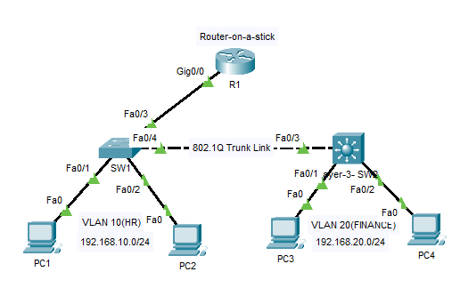

Inter-VLAN Routing (Router-on-a-Stick)

📌 Overview

This lab demonstrates Inter-VLAN Routing using Router-on-a-Stick (RoAS) along with VLAN segmentation and trunking between switches. The setup simulates a real enterprise network where multiple departments are isolated using VLANs but can communicate through a Layer 3 router.

The lab is implemented using Cisco Packet Tracer and follows CCNA 200-301 concepts.

🖧 Topology
## 🖧 Topology

2 Cisco Switches (SW1, SW2)
1 Router (R1)
Multiple PCs assigned to VLAN 10 and VLAN 20
Trunk links between switches and router

🏷️ VLAN Information
VLAN ID	Name	Department	Subnet	Default Gateway
10	HR	HR Dept	192.168.10.0/24	192.168.10.1
20	Finance	Finance	192.168.20.0/24	192.168.20.1

⚙️ Key Technologies Used
VLAN (Virtual LAN)
IEEE 802.1Q Trunking
Router-on-a-Stick (Inter-VLAN Routing)
Subnetting
Cisco IOS CLI
Packet Tracer Simulation
🔧 Configuration Summary

🔹 Switch Configuration
VLAN 10 (HR) and VLAN 20 (Finance) created
Access ports assigned to respective VLANs
Trunk ports configured between switches and router using 802.1Q
VLANs allowed on trunk: 10, 20

🔹 Router Configuration (RoAS)
Single physical interface used (G0/0)
Subinterfaces created:
G0/0.10 → VLAN 10 (192.168.10.1/24)
G0/0.20 → VLAN 20 (192.168.20.1/24)
802.1Q encapsulation configured for each VLAN

🔍 Verification Commands
Switch Verification
show vlan brief
show interfaces trunk
Router Verification
show ip interface brief
show running-config

🧪 Connectivity Testing
ping 192.168.10.x   # HR VLAN test
ping 192.168.20.x   # Finance VLAN test

✅ Results
VLAN segmentation successfully implemented
Trunk link established between switches and router
Inter-VLAN routing successfully enabled using Router-on-a-Stick
Devices across VLANs can communicate through the router
End-to-end connectivity verified successfully

🧠 Key Learning Outcomes
Understanding VLAN isolation at Layer 2
Configuring IEEE 802.1Q trunk links
Implementing Router-on-a-Stick for Inter-VLAN routing
Applying subnetting in real network scenarios
Basic Layer 3 switching concept awareness

📁 Repository Structure
02-Inter-VLAN-Routing/
├── topology.png
├── configuration-sw1.txt
├── configuration-sw2.txt
├── configuration-router.txt
├── verification.txt
└── README.md
🚀 Author

Pruthvi Raj S
Network Engineer | CCNA Enthusiast | Routing & Switching
GitHub: https://github.com/pruthvirajs2004
