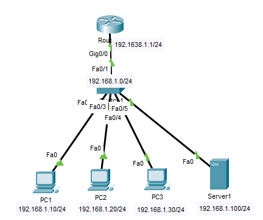

# 📘 Lab 03: OSI Model - Protocol Analysis & Layer-by-Layer Troubleshooting

---

## 📌 Overview

This lab demonstrates the **OSI (Open Systems Interconnection) Model** through
practical protocol analysis and layer-by-layer troubleshooting using
**Cisco Packet Tracer**. Each layer is observed and verified using
simulation mode and CLI commands.

The lab follows **CCNA 200-301** concepts.

---

## 🖧 Topology

### Device Summary

| Device | Role            | Interface |
|--------|-----------------|-----------|
| R1     | Gateway Router  | Gig0/0    |
| SW1    | Layer 2 Switch  | Fa0/1-4   |
| PC1    | End Host        | Fa0       |
| PC2    | End Host        | Fa0       |
| PC3    | End Host        | Fa0       |
| Server | HTTP/DNS Server | Fa0       |

### IP Addressing

| Device | IP Address      | Subnet Mask   | Default Gateway |
|--------|-----------------|---------------|-----------------|
| PC1    | 192.168.1.10    | 255.255.255.0 | 192.168.1.1     |
| PC2    | 192.168.1.20    | 255.255.255.0 | 192.168.1.1     |
| PC3    | 192.168.1.30    | 255.255.255.0 | 192.168.1.1     |
| Server | 192.168.1.100   | 255.255.255.0 | 192.168.1.1     |
| R1     | 192.168.1.1     | 255.255.255.0 | -               |

---

## 📚 OSI Model Reference

| Layer | Name         | Protocol/Device        | PDU      |
|-------|--------------|------------------------|----------|
| 7     | Application  | HTTP, DNS, FTP, SMTP   | Data     |
| 6     | Presentation | SSL/TLS, JPEG, ASCII   | Data     |
| 5     | Session      | NetBIOS, RPC           | Data     |
| 4     | Transport    | TCP, UDP               | Segment  |
| 3     | Network      | IP, ICMP, Router       | Packet   |
| 2     | Data Link    | Ethernet, Switch, MAC  | Frame    |
| 1     | Physical     | Cables, Hubs, Bits     | Bits     |

---

## ⚙️ Key Technologies Used

- OSI Model (All 7 Layers)
- ICMP (Layer 3 - Network)
- TCP/UDP (Layer 4 - Transport)
- HTTP (Layer 7 - Application)
- ARP (Layer 2/3)
- Cisco Packet Tracer Simulation Mode
- Cisco IOS CLI

---
