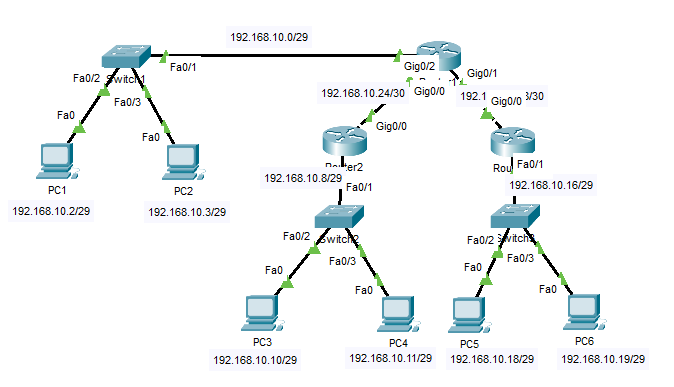

# 🌐 IP Addressing, VLSM & Static Routing Lab

A hands-on Cisco networking lab focused on IPv4 addressing, VLSM subnetting, static routing, and multi-router communication using Cisco Packet Tracer. This lab demonstrates efficient IP address allocation and end-to-end connectivity across multiple LANs and WAN links.

---

# 📚 Lab Objectives

- Configure IPv4 addressing on routers and PCs
- Design networks using VLSM (Variable Length Subnet Masking)
- Configure point-to-point WAN links using /30 subnets
- Implement static routing between multiple routers
- Verify inter-network communication using ping and routing tables
- Practice enterprise-style subnet planning

---

# 🖥️ Network Topology



This topology demonstrates VLSM-based subnetting, static routing, and multi-router communication using Cisco routers and switches.

---

# 🌐 Network Design

## LAN Networks

| LAN | Network Address | Subnet Mask | Purpose |
|------|----------------|-------------|----------|
| LAN 1 | 192.168.10.0/29 | 255.255.255.248 | PC1 & PC2 Network |
| LAN 2 | 192.168.10.8/29 | 255.255.255.248 | PC3 & PC4 Network |
| LAN 3 | 192.168.10.16/29 | 255.255.255.248 | PC5 & PC6 Network |

---

## WAN Networks

| Link | Network Address | Subnet Mask |
|------|----------------|-------------|
| R1 ↔ R2 | 192.168.10.24/30 | 255.255.255.252 |
| R1 ↔ R3 | 192.168.10.28/30 | 255.255.255.252 |

---

# 📑 IP Addressing Table

| Device | Interface | IP Address |
|--------|------------|-------------|
| R1 | G0/0 | 192.168.10.25/30 |
| R1 | G0/1 | 192.168.10.29/30 |
| R1 | G0/2 | 192.168.10.1/29 |
| R2 | G0/0 | 192.168.10.26/30 |
| R2 | G0/1 | 192.168.10.9/29 |
| R3 | G0/0 | 192.168.10.30/30 |
| R3 | G0/1 | 192.168.10.17/29 |
| PC1 | NIC | 192.168.10.2 |
| PC2 | NIC | 192.168.10.3 |
| PC3 | NIC | 192.168.10.10 |
| PC4 | NIC | 192.168.10.11 |
| PC5 | NIC | 192.168.10.18 |
| PC6 | NIC | 192.168.10.19 |

---

# 🛠️ Technologies Used

- Cisco Packet Tracer
- IPv4 Addressing
- VLSM
- Static Routing
- Cisco IOS CLI
- Multi-Router Communication

---

# ⚙️ Routing Configuration

This lab uses static routing for communication between remote networks.

## Example Static Route

```cisco
ip route 192.168.10.16 255.255.255.248 192.168.10.30
```

---

# ✅ Verification Commands

## Router Verification

```cisco
show ip interface brief
show ip route
```

## Connectivity Testing

```bash
ping 192.168.10.18
ping 192.168.10.10
```

Successful replies confirm proper routing and connectivity.

---

# 📂 Repository Files

```text
04-IP-Addressing-and-Subnetting/
├── README.md
├── topology.png
├── 04-IP-Addressing-and-Subnetting.pkt
├── router-config.md
├── verification.md
└── subnetting-notes.md
```

---

# 🎯 Skills Demonstrated

- IPv4 Address Planning
- Efficient VLSM Subnetting
- Static Routing Configuration
- WAN Link Addressing
- Troubleshooting Connectivity Issues
- Cisco Router Configuration
- Enterprise Network Design Concepts

---

# 👨‍💻 Author

Pruthvi Raj S

🎓 Networking Enthusiast | CCNA Learner | Cisco Packet Tracer Labs

Passionate about building hands-on networking labs focused on routing, switching, subnetting, VLANs, and enterprise network design concepts using Cisco technologies.

🔗 GitHub: https://github.com/pruthvirajs2004

---

# 📄 License

This project is licensed under the MIT License.
