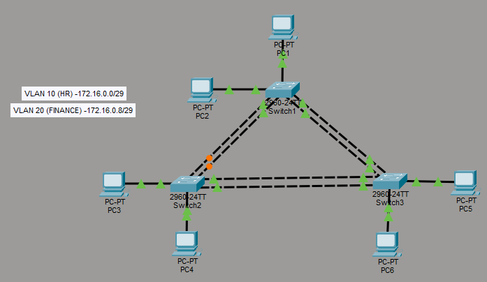

# 🌐 STP & EtherChannel Lab

A hands-on Cisco networking lab demonstrating VLANs, Trunking, Spanning Tree Protocol (STP), EtherChannel, LACP, Static EtherChannel, and PAgP using Cisco Packet Tracer.

This lab focuses on Layer 2 redundancy, loop prevention, link aggregation, and enterprise switch communication concepts used in real-world campus networks.

---

# 📚 Lab Objectives

* Configure VLANs
* Configure Access Ports
* Configure Trunk Ports
* Implement Spanning Tree Protocol (STP)
* Configure Root Bridge Election
* Configure LACP EtherChannel
* Configure Static EtherChannel
* Configure PAgP EtherChannel
* Verify Layer 2 Redundancy
* Prevent Switching Loops
* Verify EtherChannel Bundling

---

# 🖥️ Network Topology



The topology uses three Cisco switches connected redundantly to demonstrate STP operations and EtherChannel technologies.

---

# 🌐 VLAN Configuration

| VLAN ID | VLAN Name |
| ------- | --------- |
| 10      | HR        |
| 20      | Finance   |

---

# 🔌 Switch Interconnections

| Connection | Interfaces    |
| ---------- | ------------- |
| SW1 ↔ SW2  | Fa0/1 – Fa0/2 |
| SW2 ↔ SW3  | Fa0/3 – Fa0/4 |
| SW1 ↔ SW3  | Fa0/5 – Fa0/6 |

---

# 🌐 Technologies Used

* VLANs
* Trunking
* STP
* EtherChannel
* LACP
* Static EtherChannel
* PAgP
* Cisco IOS CLI

---

# 📚 Topics Covered

| Feature             | Description                             |
| ------------------- | --------------------------------------- |
| STP                 | Prevents Layer 2 loops                  |
| Root Bridge         | Central STP switch                      |
| Trunking            | VLAN forwarding between switches        |
| LACP                | IEEE standard EtherChannel              |
| Static EtherChannel | Manual EtherChannel using mode on       |
| PAgP                | Cisco proprietary EtherChannel protocol |

---

# 🌐 STP Overview

Spanning Tree Protocol (STP) prevents switching loops by placing redundant ports into a blocking state while maintaining backup paths for redundancy.

## STP Functions

* Prevents broadcast storms
* Prevents MAC address table instability
* Creates loop-free Layer 2 topology
* Provides redundant path availability

---

# 🌐 EtherChannel Overview

EtherChannel bundles multiple physical interfaces into one logical interface called a Port-Channel.

## EtherChannel Benefits

* Increased bandwidth
* Redundancy
* Load balancing
* Simplified management
* Faster convergence

---

# 🌐 EtherChannel Types Used

| EtherChannel Type   | Protocol          | Modes            |
| ------------------- | ----------------- | ---------------- |
| Static EtherChannel | None              | on               |
| LACP                | IEEE 802.3ad      | active / passive |
| PAgP                | Cisco Proprietary | desirable / auto |

---

# 🌐 Root Bridge Configuration

SW1 was configured as the STP Root Bridge using:

```cisco id="jlwm7g"
spanning-tree vlan 1 priority 4096
```

---

# 🌐 LACP Configuration

LACP was configured between:

```text id="jlwm1k"
SW1 ↔ SW2
```

Using:

```cisco id="jlwm4d"
channel-group 1 mode active
```

---

# 🌐 Static EtherChannel Configuration

Static EtherChannel was configured between:

```text id="jlwm8x"
SW2 ↔ SW3
```

Using:

```cisco id="jlwm2h"
channel-group 3 mode on
```

---

# 🌐 PAgP Configuration

PAgP EtherChannel was configured between:

```text id="jlwm5s"
SW1 ↔ SW3
```

Using:

```cisco id="jlwm9m"
channel-group 2 mode desirable
```

and

```cisco id="jlwm0x"
channel-group 2 mode auto
```

---

# ✅ Verification Commands

```cisco id="jlwm3n"
show vlan brief
show interfaces trunk
show spanning-tree
show etherchannel summary
```

These commands verify:

* VLAN membership
* Trunk operation
* STP root bridge and blocking ports
* EtherChannel status
* Port-channel formation

---

# 📡 Expected EtherChannel Output

```text id="jlwm6w"
Po1(SU)
Po2(SU)
Po3(SU)
```

Meaning:

* S = Layer 2
* U = In Use

---

# 📂 Repository Structure

```text id="jlwm4r"
06-STP-EtherChannel/
├── README.md
├── topology.png
├── STP-EtherChannel-Lab.pkt
├── stp-config.md
├── lacp-config.md
├── static-etherchannel-config.md
├── pagp-config.md
└── verification.md
```

---

# 🎯 Skills Demonstrated

* VLAN Configuration
* Access Port Configuration
* Trunk Configuration
* STP Root Bridge Election
* EtherChannel Configuration
* LACP Configuration
* Static EtherChannel Configuration
* PAgP Configuration
* Cisco Switch Administration
* Redundant Layer 2 Design

---

# 🧠 Important Networking Concepts

## STP

STP prevents switching loops in redundant Layer 2 topologies.

## LACP

LACP is an IEEE standard protocol used to dynamically negotiate EtherChannel links.

## Static EtherChannel

Static EtherChannel manually bundles interfaces without negotiation.

## PAgP

PAgP is Cisco proprietary and dynamically negotiates EtherChannel formation between Cisco devices.

---

# 👨‍💻 Author

## Pruthvi Raj S

🎓 Networking Enthusiast | CCNA Learner | Cisco Packet Tracer Labs

Passionate about building hands-on networking labs focused on routing, switching, subnetting, VLANs, EtherChannel, STP, and enterprise network design using Cisco technologies.

### 🔗 Connect With Me

* GitHub: https://github.com/pruthvirajs2004
* Cisco NetAcad: https://www.netacad.com/
* LinkedIn: https://www.linkedin.com/in/pruthviraj154

---
---

# 📄 License

This project is licensed under the MIT License.
