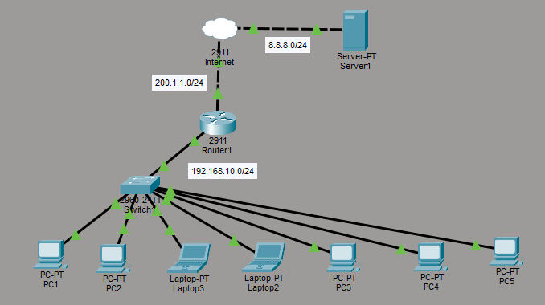

# 🌐 NAT & PAT Lab

A hands-on Cisco Packet Tracer networking lab demonstrating Static NAT, Dynamic NAT, and PAT (NAT Overload) configurations used in enterprise networks for internet connectivity and IPv4 address conservation.

---

# 📚 Lab Objectives

* Configure Static NAT
* Configure Dynamic NAT
* Configure PAT (NAT Overload)
* Configure Inside and Outside NAT interfaces
* Configure NAT Pools
* Configure ACLs for NAT
* Verify NAT translations
* Simulate enterprise internet connectivity

---

# 🖥️ Network Topology



---

# 🌐 Topology Overview

```text
PCs → Switch → R1 → ISP Router → Server
```

---

# 🌐 Devices Used

| Device            | Quantity |
| ----------------- | -------- |
| Cisco 2811 Router | 2        |
| Cisco 2960 Switch | 1        |
| PCs               | 2        |
| Server            | 1        |

---

# 🌐 IP Addressing Table

| Device     | Interface | IP Address       |
| ---------- | --------- | ---------------- |
| R1         | G0/0      | 192.168.10.1/24  |
| R1         | G0/2      | 200.1.1.1/24     |
| ISP Router | G0/0      | 200.1.1.2/24     |
| ISP Router | G0/1      | 8.8.8.1/24       |
| Server     | Fa0       | 8.8.8.2/24       |
| PC1        | NIC       | 192.168.10.10/24 |
| PC2        | NIC       | 192.168.10.20/24 |

---

# 🌐 Default Gateways

| Device | Gateway      |
| ------ | ------------ |
| PC1    | 192.168.10.1 |
| PC2    | 192.168.10.1 |
| Server | 8.8.8.1      |

---

# 🌐 Technologies Used

* Static NAT
* Dynamic NAT
* PAT (NAT Overload)
* Access Control Lists (ACL)
* Static Routing
* Cisco IOS CLI

---

# 🌐 NAT Types Implemented

| NAT Type    | Description                                |
| ----------- | ------------------------------------------ |
| Static NAT  | One-to-one IP translation                  |
| Dynamic NAT | Pool-based translation                     |
| PAT         | Many-to-one translation using port numbers |

---

# 🌐 Router Roles

| Router     | Role                  |
| ---------- | --------------------- |
| R1         | NAT/PAT Edge Router   |
| ISP Router | Internet/Cloud Router |

---

# 🌐 NAT Concepts

## Inside Local

Private IP address used inside the LAN.

Example:

```text
192.168.10.10
```

---

## Inside Global

Public IP address after NAT translation.

Example:

```text
200.1.1.100
```

---

## PAT (Overload)

Allows multiple devices to share one public IP using different port numbers.

---

# 🌐 Verification Commands

```cisco
show ip nat translations
show ip nat statistics
show ip route
show running-config
```

---

# 🌐 Static Routing Used

## On R1

```cisco
ip route 0.0.0.0 0.0.0.0 200.1.1.2
```

---

## On ISP Router

```cisco
ip route 192.168.10.0 255.255.255.0 200.1.1.1
```

---

# 🌐 Testing

From PCs:

```text
ping 8.8.8.2
```

Successful replies verify:

* Routing
* NAT translation
* End-to-end connectivity

---

# 🌐 Repository Structure

```text
08-NAT-PAT/
├── README.md
├── topology.png
├── NAT-PAT-Lab.pkt
├── static-nat-config.md
├── dynamic-nat-config.md
├── pat-config.md
└── verification.md
```

---

# 🎯 Skills Demonstrated

* NAT Configuration
* PAT Overload
* Dynamic NAT Pools
* ACL Configuration
* WAN Routing
* Cisco Router Administration
* Enterprise Internet Connectivity

---

# 👨‍💻 Author

## Pruthvi Raj S

🎓 Networking Enthusiast | CCNA Learner | Cisco Packet Tracer Labs

Passionate about networking, routing, switching, NAT, VLANs, routing protocols, and enterprise infrastructure design using Cisco technologies.

### 🔗 Connect With Me

* GitHub: https://github.com/pruthvirajs2004
* Cisco NetAcad: https://www.netacad.com/
* LinkedIn: Add your LinkedIn profile link here

---

# 📄 License

This project is licensed under the MIT License.
