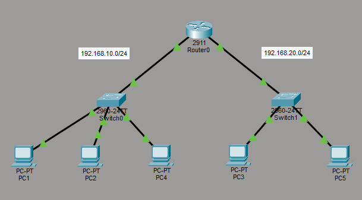

# 🌐 ACL Lab — Standard, Extended & Named ACLs

A comprehensive Cisco Packet Tracer networking lab demonstrating all major Access Control List (ACL) configurations including:

* Standard ACL
* Extended ACL
* Named Standard ACL
* Named Extended ACL

This lab simulates enterprise-level traffic filtering and network security policies using Cisco IOS.

---

# 📚 Lab Objectives

* Configure Standard ACLs
* Configure Extended ACLs
* Configure Named ACLs
* Apply ACLs inbound and outbound
* Control traffic between networks
* Filter traffic using:

  * Source IP
  * Destination IP
  * Protocols
  * Port numbers
* Verify ACL functionality
* Understand ACL placement rules

---

# 🖥️ Network Topology



---

# 🌐 Topology Overview

```text id="jgwvhu"
PC1   PC2   PC4
  \    |    /
      SW1
       |
      R1
       |
      SW2
     /   \
   PC3   PC5
```

---

# 🌐 Devices Used

| Device            | Quantity |
| ----------------- | -------- |
| Cisco 2811 Router | 1        |
| Cisco 2960 Switch | 2        |
| PCs               | 5        |

---

# 🌐 IP Addressing Table

## Network 1 — 192.168.10.0/24

| Device | Interface | IP Address    |
| ------ | --------- | ------------- |
| R1     | G0/0      | 192.168.10.1  |
| PC1    | NIC       | 192.168.10.10 |
| PC2    | NIC       | 192.168.10.20 |
| PC4    | NIC       | 192.168.10.30 |

---

## Network 2 — 192.168.20.0/24

| Device | Interface | IP Address    |
| ------ | --------- | ------------- |
| R1     | G0/1      | 192.168.20.1  |
| PC3    | NIC       | 192.168.20.10 |
| PC5    | NIC       | 192.168.20.20 |

---

# 🌐 Default Gateways

| Device | Gateway      |
| ------ | ------------ |
| PC1    | 192.168.10.1 |
| PC2    | 192.168.10.1 |
| PC4    | 192.168.10.1 |
| PC3    | 192.168.20.1 |
| PC5    | 192.168.20.1 |

---

# 🌐 ACL Types Implemented

| ACL Type           | Description                                               |
| ------------------ | --------------------------------------------------------- |
| Standard ACL       | Filters based on source IP only                           |
| Extended ACL       | Filters based on source, destination, protocol, and ports |
| Named Standard ACL | Standard ACL using names                                  |
| Named Extended ACL | Extended ACL using names                                  |

---

# 🌐 ACL Scenarios Implemented

| Scenario                           | ACL Type           |
| ---------------------------------- | ------------------ |
| Block PC1 from Network 20          | Standard ACL       |
| Block PC1 → PC3 only               | Extended ACL       |
| Block PC2 using named ACL          | Named Standard ACL |
| Block HTTP traffic from PC1 to PC3 | Named Extended ACL |

---

# 🌐 Important ACL Concepts

## Implicit Deny

Every ACL automatically ends with:

```text id="g6uwwj"
deny any
```

Traffic not explicitly permitted is automatically denied.

---

# 🌐 ACL Placement Rules

| ACL Type     | Best Placement       |
| ------------ | -------------------- |
| Standard ACL | Close to destination |
| Extended ACL | Close to source      |

---

# 🌐 Verification Commands

```cisco id="l76p7x"
show access-lists
show ip interface
show running-config
show ip protocols
```

---

# 🌐 Testing

## Ping Test

```text id="4wj7lu"
ping 192.168.20.10
```

---

## HTTP Test

```text id="j60gzi"
http://192.168.20.10
```

---

# 🌐 Expected Results

| Source    | Destination | Result    |
| --------- | ----------- | --------- |
| PC1 → PC3 | ICMP        | ❌ Blocked |
| PC2 → PC3 | ICMP        | ✅ Allowed |
| PC4 → PC5 | ICMP        | ✅ Allowed |
| PC1 → PC3 | HTTP        | ❌ Blocked |
| PC2 → PC3 | HTTP        | ✅ Allowed |

---

# 🌐 Repository Structure

```text id="lq4f6m"
09-ACL/
├── README.md
├── topology.png
├── Standard-ACL-Lab.pkt
├── Extended-ACL-Lab.pkt
├── standard-acl-config.md
├── extended-acl-config.md
├── named-standard-acl.md
├── named-extended-acl.md
└── verification.md
```

---

# 🎯 Skills Demonstrated

* Standard ACL Configuration
* Extended ACL Configuration
* Named ACLs
* Traffic Filtering
* Protocol Filtering
* Port-Based Filtering
* Cisco IOS CLI
* Enterprise Security Concepts
* Network Troubleshooting

---

# 🌐 Key Learning Outcomes

After completing this lab you will understand:

* ACL logic
* ACL placement
* Wildcard masks
* Inbound vs outbound filtering
* Protocol filtering
* Port filtering
* Enterprise traffic security

---

# 👨‍💻 Author

## Pruthvi Raj S

🎓 Networking Enthusiast | CCNA Learner | Cisco Packet Tracer Labs

Passionate about networking, routing, switching, ACLs, NAT, VLANs, routing protocols, and enterprise infrastructure design using Cisco technologies.

### 🔗 Connect With Me

* GitHub: https://github.com/pruthvirajs2004
* Cisco NetAcad: https://www.netacad.com/
* LinkedIn: https://www.linkedin.com/in/pruthviraj154

---

# 📄 License

This project is licensed under the MIT License.
