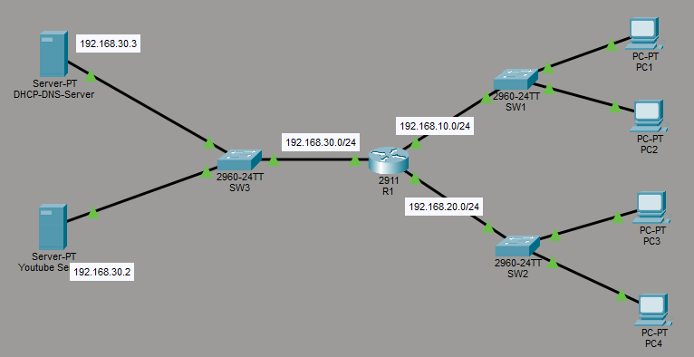

# 09 — DHCP & DNS

Automated IP allocation and name resolution services

## Overview

This lab demonstrates enterprise-level network communication using:

* DHCP
* DNS
* Inter-network Routing
* Web Server Communication
* Multi-LAN Connectivity

The topology contains multiple LANs connected through a router, along with centralized DHCP and DNS services.

---

# Topology



## Network Design

* LAN 10 → PC1 & PC2
* LAN 20 → PC3 & PC4
* Server Network → DHCP Server, DNS Server, YouTube Server

The router performs routing between all networks.

---

# Devices Used

| Device Type | Count |
| ----------- | ----- |
| Router      | 1     |
| Switches    | 3     |
| PCs         | 4     |
| Servers     | 2     |

---

# IP Addressing Scheme

| Device          | Interface | IP Address      |
| --------------- | --------- | --------------- |
| R1              | G0/0      | 192.168.10.1/24 |
| R1              | G0/1      | 192.168.20.1/24 |
| R1              | G0/2      | 192.168.30.1/24 |
| DHCP/DNS Server | NIC       | 192.168.30.3    |
| YouTube Server  | NIC       | 192.168.30.2    |

---

# Features Implemented

* DHCP IP Assignment
* DNS Name Resolution
* Router-Based Inter-Network Routing
* Web Server Simulation
* End-to-End Connectivity Testing
* Centralized Services Architecture

---

# DHCP Configuration

Two DHCP pools are configured:

## LAN10 Pool

```bash
network 192.168.10.0 255.255.255.0
default-router 192.168.10.1
dns-server 192.168.30.3
```

## LAN20 Pool

```bash
network 192.168.20.0 255.255.255.0
default-router 192.168.20.1
dns-server 192.168.30.3
```

---

# DNS Configuration

DNS Record:

```text
youtube.com → 192.168.30.2
```

Clients use the DNS server to resolve the domain name before communicating with the web server.

---

# Verification Commands

## Verify Interfaces

```bash
show ip interface brief
```

## Verify DHCP Bindings

```bash
show ip dhcp binding
```

## Verify PC IP Assignment

```bash
ipconfig /all
```

## Verify DNS

```bash
ping youtube.com
```

## Verify Web Access

Open browser:

```text
http://youtube.com
```

---

# Expected Results

* PCs receive IP addresses dynamically
* DNS successfully resolves youtube.com
* Router routes traffic between networks
* PCs successfully reach the web server
* Full end-to-end communication achieved

---

# Technologies Used

* Cisco Packet Tracer
* DHCP
* DNS
* IPv4 Addressing
* Routing & Switching
* Enterprise Network Design

---

# Repository Structure

```text
09-DHCP-DNS/
│
├── README.md
├── topology.png
├── Router1-config.md
├── All-Switches-config.md
├── DHCP-DNS-Server-Configuration.md
├── YouTube-Server.md
└── verification.md
```

---

# Author

Pruthvi Raj S

Network Engineer | CCNA | Routing & Switching | Network Troubleshooting | Cloud & DevOps Enthusiast
